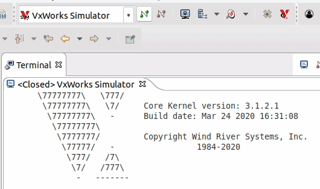
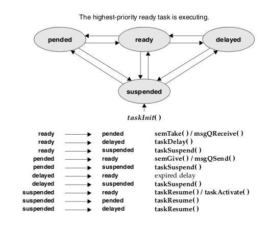

# VxWorks Basics
This repo represents my first fun approach to Embedded programming. Experience made during the SWE4ES course at the University of Florence using <a href="https://en.wikipedia.org/wiki/VxWorks"> VxWorks </a> RTOS.

```
 \77777777\          /77777777/
  \77777777\        /77777777/
   \77777777\      /77777777/
    \77777777\    /77777777/
     \77777777\   \7777777/
      \77777777\   \77777/              VxWorks 7 SMP 64-bit
       \77777777\   \777/
        \77777777\   \7/     Core Kernel version: 3.1.2.1
         \77777777\   -      Build date: Mar 24 2020 16:31:08
          \77777777\
           \7777777/         Copyright Wind River Systems, Inc.
            \77777/   -                 1984-2020
             \777/   /7\
              \7/   /777\
               -   -------

                   Board: SIMLINUX board
               CPU Count: 2
          OS Memory Size: 508MB
        ED&R Policy Mode: Deployed
     Debug Agent: Started (always)
         Stop Mode Agent: Started (always)
```

## Know-How
In this "projects" are presents two dkm implemented on Wind River Workbench to test semaphores and periodic activations.

Two modules has been implemented, we can show workspase tree:

```
├── test_periodic
│   ├── dkm.c
│   ├── dummyTask.c
│   ├── dummyTask.h
│   └── ...         # building
│
└── test_semaphores
    ├── dkm.c
    ├── mutual.h
    └── ...         # building
```

You can test the two dkm in a single virtual target as <a href="https://www.windriver.com/"> Windriver's </a> VxSim, by typing the following instructions in the Kernel Shell.
```
sp start        # launch task for test_semaphores
sp init         # launch task for test_periodic
```

## VxWorks
My workstation is used as host with VxSim as target and the system viewer capture the events and allows data exchange between.

Windriver allows to create _download kernem modules_ (**DKM**). These are loaded into the target with "target actions for the selected connections" and "load modules".

<p align=center>
    
</p>

## Tasks
The library is <a href="https://docs.windriver.com/bundle/vxworks_7_application_core_os_sr0630-enus/page/CORE/taskLib.html"> taskLib.h </a>.

<p align=center>
    
</p>

* Task Creation and Activation
    * taskSpawn( ) - Spawns (creates and activates) a new task.
    * taskInit( ) - Initializes a new task.
    * taskActivate( ) - Activates an initialized task.
* Task Name and ID Routines
    * taskName( ) - Gets the task name associated with a task ID.
    * taskNameToId( ) - Looks up the task ID associated with a task.
    * taskIdSelf( ) - Gets the calling task’s ID.
    * taskIdVerify( ) - Verifies the existence of a specified task.
* Task Information Routines
    * taskIdListGet( ) - Fills an array with the IDs of all active tasks.
    * taskInfoGet( ) - Gets information about a task.
    * taskPriorityGet( ) - Examines the priority of a task.
    * taskRegsGet( ) - Examines a task’s registers (cannot be used for current task).
* Task-Deletion Routines
    * exit( ) - Terminates the calling task and frees memory (task stacks and task control blocks only).
    * taskDelete( ) - Terminates a specified task and frees memory (task stacks and task control blocks only).
    * taskSafe( ) - Protects the calling task from deletion.
    * taskUnsafe( ) - Undoes a taskSafe( ) (makes the calling task available for deletion). 
* Task Control Routines
    * taskSuspend( ) - Suspends a task.
    * taskResume( ) - Resumes a task.
    * taskRestart( ) - Restarts a task.
    * taskDelay( ) - Delays a task, delay units and resolution in ticks.
    * nanosleep( ) - Delays a task; delay units are nanoseconds.

## Semaphores
The library is <a href="https://docs.windriver.com/bundle/vxworks_7_application_core_os_sr0630-enus/page/CORE/semLib.html">semLib.h</a>.

* semTake() - take the resourse (decrease).
* semGive() - release the resource (increase).
* semBCreate() - spawns a binary semaphore.
* semCCreate() - spawns a counting semaphore. 
* semMCreate() - spawns a mutex semaphore.

## Periodic Activations
The library is <a href="https://docs.windriver.com/bundle/vxworks_7_application_core_os_sr0630-enus/page/CORE/sysLib.html">sysLib.h</a>.

* sysAuxClkConnect( ) - connect a routine to the auxiliary clock interrupt.
* sysAuxClkDisable( ) - turn off auxiliary clock interrupts.
* sysAuxClkEnable( ) - turn on auxiliary clock interrupts.
* sysAuxClkRateGet( ) - get the auxiliary clock rate.
* sysAuxClkRateSet( ) - set the auxiliary clock rate.